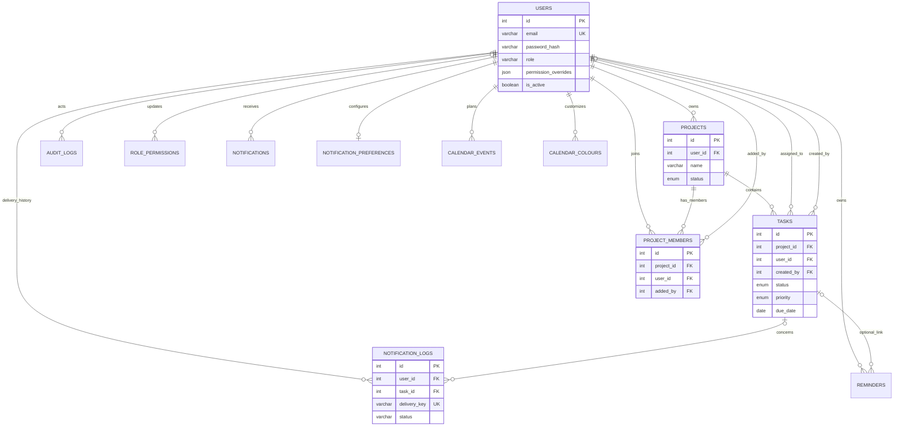
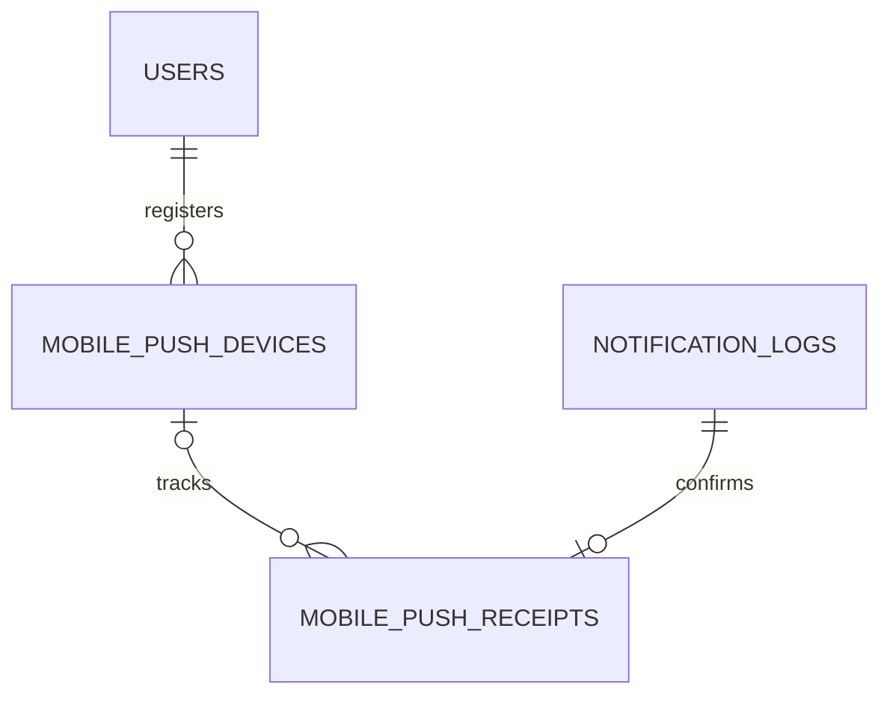

# Database schema

MySQL 8.0+, InnoDB, utf8mb4. The migration sequence is in [database/README.md](database/README.md). IDs are integer surrogate keys except role_permissions and calendar_colours. MySQL sessions run in UTC; DATE fields represent calendar dates.

| Table | Purpose and key fields | Primary key | Foreign keys / deletion |
| --- | --- | --- | --- |
| users | full_name, unique email, password_hash, role, department, job_title, JSON permission_overrides, is_active, timestamps | id | None |
| projects | user_id owner, name, description, status, start_date/end_date, timestamps | id | owner to users; CASCADE |
| project_members | project_id, user_id, added_by, created_at; unique project/user membership | id | project/member/added_by to projects/users; CASCADE |
| tasks | project_id, user_id **assignee** (nullable), created_by, name, description, status, priority, due_date, timestamps | id | project/assignee to projects/users CASCADE; creator to users SET NULL |
| audit_logs | user_id actor, actor_name/email snapshots, action, resource_type/id, details JSON text, IP, request ID, created_at | id | actor to users SET NULL; resource IDs intentionally retain deleted-resource history |
| role_permissions | role_key, JSON permissions, version, updated_by, updated_at | role_key | updated_by to users SET NULL |
| notifications | user_id, type, title, message, polymorphic resource_type/id, is_read, created_at/read_at | id | recipient to users CASCADE; resource ID is not a foreign key |
| notification_preferences | unique user_id, eight boolean channel/type choices, timestamps | id | user to users CASCADE |
| notification_logs | user_id, task_id, notification_type, channel, status, sent_at, safe error code, nullable unique delivery_key | id | user to users CASCADE; task to tasks SET NULL |
| reminders | user_id, optional task_id, title/notes, UTC remind_at, scheduled/sent/dismissed, sent_at, timestamps | id | owner to users CASCADE; task to tasks SET NULL |
| calendar_events | user_id, title/notes, event_date, nullable start_time/end_time, timestamps | id | owner to users CASCADE |
| calendar_colours | user_id, item_key, colour #RRGGBB | (user_id,item_key) | owner to users CASCADE |

## Constraints and indexes

- Email has a database unique constraint; registration/admin creation also handle races.
- Membership has a unique (project_id,user_id) key. Owners are represented separately.
- Project/task enums are enforced by MySQL and request validation.
- Task assignees must be active owners/members; application checks enforce this cross-table rule.
- User indexes cover role/active filters. Project indexes cover owner/status.
- Task indexes cover project, assignee, creator, status, priority, due date and (project_id,status,due_date).
- Audit indexes cover actor, action, resource and created_at. Snapshots retain actor identity after account changes.
- Notification indexes cover (user_id,is_read,created_at,id) and (user_id,created_at,id).
- Delivery lookups and a unique delivery_key protect daily claims. The key encodes local application date, user, task, type and channel; historical/assignment logs have null keys.
- Reminders index (status,remind_at) and (user_id,remind_at). Event lookups index owner/date.
- Profile/password data is never embedded in JWTs, logs or audit details. Personal reminder/event content is omitted from shared audit history.

No account-deletion endpoint exists. Deactivate users instead of manually deleting them: current historical foreign keys cascade owned projects and assigned tasks when a user is physically deleted. Database administrators must understand this consequence.

## ER diagram

## Backup and retention

Use consistent InnoDB snapshots (`mysqldump --single-transaction`) or managed database backups. Keep encrypted backups outside the application host and regularly restore to an isolated database. Never test destructive setup against production. Audit/notification retention is currently an operator responsibility; no automatic purging is configured.

## Mobile push follow-up

Run `server/scripts/migratePush.js` (included in db:migrate) to add `notification_preferences.push_due_tomorrow BOOLEAN NOT NULL DEFAULT FALSE` and `database/migration_mobile_push.sql`. Existing preferences/data remain intact.

- **mobile_push_devices**: integer primary key; user_id FK to users (cascade delete); unique case-sensitive expo_token; platform; expires_at and updated_at. Owner/expiry index finds active devices. Registration renews for 30 days.
- **mobile_push_receipts**: integer primary key; unique log_id FK to notification_logs (cascade delete); nullable device_id FK to mobile_push_devices (set null on delete); unique Expo ticket_id, created_at and checked_at. Pending-receipt index supports the 15-minute receipt checker.
- Existing **notification_logs** accepts channel PUSH. A unique delivery_key includes the recipient/task/day and a token hash; status PROCESSING -> ACCEPTED (Expo ticket) -> SENT/FAILED (receipt). Tokens and provider message text are excluded from audit/error logs.

