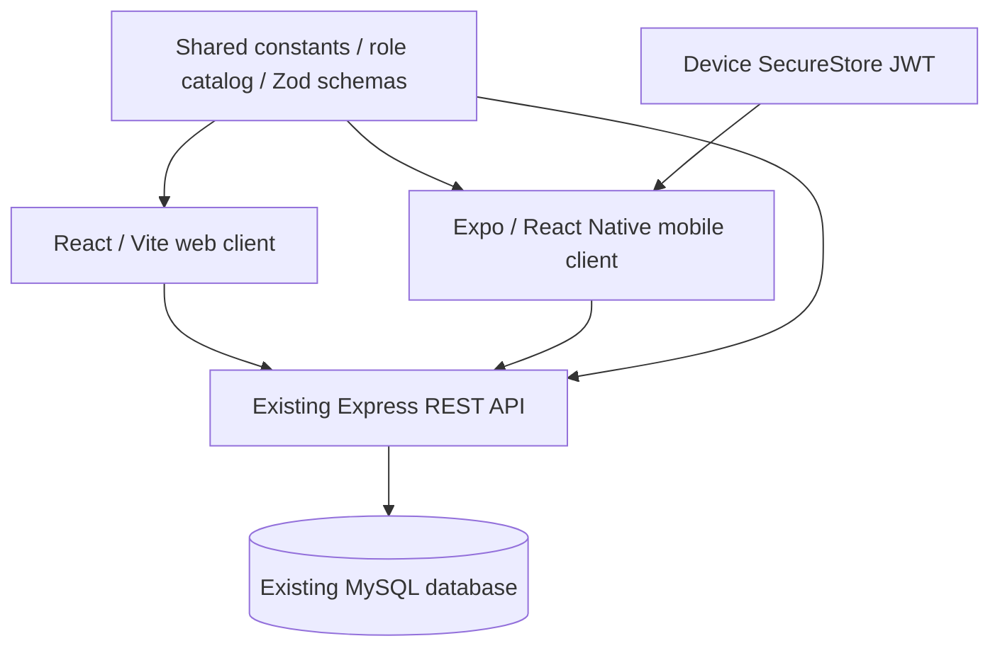

# Stage 8 implementation review

The initial Stage 8 implementation adds an Expo mobile application using the existing backend, database and shared definitions. It does not add new production APIs for mobile, another auth/RBAC system, a mobile database, native push delivery or offline mutation queues. The optional interactive test harness uses the Stage 7 disposable database guard and is test-only.

## Architecture and navigation



Independent mobile package follows the current server/client package layout. Metro includes shared source and root dependencies; the native React runtime is resolved from mobile. App.tsx loads the three used Jakarta font weights locally, provides safe areas, auth, notification counts and an error boundary. React Navigation has Login/Register while signed out; Dashboard/Projects/Tasks/Notifications/More tabs while signed in; resource/forms/reporting/team/settings/admin stack screens above them. Android back uses native stack/modal behavior.

## Authentication and access

Login/register/logout/me use the current auth API and its existing top-level token/user envelopes. Registration remains Team Member and then uses normal login. SecureStore is the only persistent token store, with device-only unlocked accessibility. Startup verifies current access through /me; offline startup offers Retry without discarding the token. Private 401 clears session/storage and displays the requested expiry message; public wrong-password errors remain login errors. Logout immediately removes local access even when acknowledgement fails. Backend logout is still stateless and does not revoke copied JWTs.

All eight role keys come from shared/access.json and shared/constants. UI uses effective /me permissions, with the fixed admin/super_admin gate for admin tools. Member status checks also require matching assignee. Self changes/protected administrator targets and protected role policies are disabled. Role edits submit the existing policy version; 409 asks the user to refresh. Express remains authoritative for project membership, effective grants, assignment eligibility and administrative boundaries.

## Product coverage

Dashboard presents role-aware metrics, active project cards, upcoming/overdue work and daily recorded activity. Project/task lists use 20-row server pages with explicit load more, stable ordering, debounced search and filters. Project details include dates, owner/members, progress and paginated tasks. CRUD forms import shared Zod rules, use native dates and keyboard scrolling, and expose existing permitted mutations. Task details provide scoped assignment, status/priority changes, project links and deletion confirmation.

Analytics renders mobile distributions and weekly activity from the scoped report. Team selects a project, shows owner/members/workload, uses candidate search and existing membership APIs, and opens the device mail composer. Notifications use the existing owned inbox, unread count, read/read-all and task/project links. Settings keeps email/in-app/browser semantics explicit. More hides unauthorized screens. Native admin includes paged/searchable users, user details/role changes, protected/versioned role policy editing and paged/searchable audit details.

Focus, foreground and pull refresh reload authoritative API data. Successful mutations refetch rather than pretending a local mutation succeeded. The badge polls every 30 seconds while active. Request revisions reject stale filter results, pages deduplicate IDs and delayed badge responses from another session are discarded. Network failures/timeouts and safe HTTP errors have readable retry states. API mutations are never automatically retried. Cached offline viewing is not implemented.

Dark navy/charcoal cards, white/muted text, blue actions, semantic badges, Jakarta Sans and Lucide icons preserve the requested mobile design and the web's brand language. The current web theme is light; its pages are not redesigned. App/adaptive icons derive from the existing web SVG. Controls include accessible names and 48dp targets, safe areas, native confirmation, skeleton animation and native-stack transitions.

## Compatible backend changes

Only optional pagination/deadline filters and project detail task summary were needed. Existing unpaged web envelopes stay intact. Project/task SQL uses the existing scoped WHERE clause and allowlisted sort plus an ID tie-breaker, bound LIMIT/OFFSET and one extra row for has_more. New page/limit/due_date/overdue/tz values are validated. Project summaries remain null without effective tasks.view. Existing endpoints and database schema are reused; no production migration is required. OpenAPI, Postman and Markdown were updated for these options.

## Verification

- 50 backend tests pass, including five new real mobile transport/Express/MySQL integration flows using guarded test databases and mocked email.
- 33 mobile tests pass across seven suites, including a regression check for native raw-text rendering failures.
- Mobile API/permissions/session/storage coverage: 89.26% lines and 84.75% statements on the measured core; UI coverage is intentionally not claimed to be exhaustive.
- TypeScript succeeds; Expo Doctor passes all 21 checks.
- Android Hermes production export succeeds with a supplied placeholder HTTPS URL; it is not a signed APK.
- Existing Vite production build and all 15 browser tests pass; existing web lint still reports six advisory warnings.
- SDK 57 Expo Go runs on the Android 37 x86_64 emulator. Native login, scoped dashboard and task list have been observed; further native flow results are recorded in the final verification below.

No physical Android, iOS, EAS remote build, signing, hosting or Play Store upload has been performed. APK/internal share profiles are prepared and documented. Deployment still needs the operator's Expo account, actual HTTPS API and signing/build review.

## Dependency advisories

On 2026-10-08, mobile npm audit reports **51 affected packages (46 high, 5 moderate; no critical)** after compatible fixes. These stem from three upstream advisories: braces <=3.0.3 (Metro glob pattern stack exhaustion), node-forge <=1.4.0 (Expo tooling RSA signature verification), and sprintf-js <=1.1.3 (Jest/config tooling precision denial of service). Their latest published versions still have advisories. They are tooling dependencies, rather than the application's JWT/password services, but remain unresolved release review items. Do not expose Metro as a production server. npm audit's force suggestion downgrades Expo to SDK 44 and is incompatible with this application, so it was not applied.

The xcode/uuid advisory is resolved with a scoped uuid 11.1.1 override; its CommonJS v4 API remains compatible with xcode's usage. RN Testing Library 13.3.3 and renderer 19.2.3 are pinned together to match Expo's React version, avoiding the new renderer's React 19.3 peer mismatch. Lockfile records all dependency versions. Review future compatible Expo/tooling patches before public release; this stage does not claim a clean mobile dependency audit.

## Packages

Runtime/native configuration packages:

- `@expo-google-fonts/plus-jakarta-sans`: `^0.4.2`
- `@react-native-community/datetimepicker`: `9.1.0`
- `@react-navigation/bottom-tabs`: `^7.20.0`
- `@react-navigation/native`: `^7.5.0`
- `@react-navigation/native-stack`: `^7.20.0`
- `expo`: `~57.0.27`
- `expo-build-properties`: `~57.0.22`
- `expo-dev-client`: `~57.0.19`
- `expo-font`: `~57.0.4`
- `expo-secure-store`: `~57.0.4`
- `expo-status-bar`: `~57.0.1`
- `lucide-react-native`: `^1.53.0`
- `react`: `19.2.3`
- `react-native`: `0.86.3`
- `react-native-safe-area-context`: `~5.7.0`
- `react-native-screens`: `~4.26.0`
- `react-native-svg`: `15.15.4`
- `zod`: `^4.6.5`

Development/test packages:

- `@testing-library/react-native`: `13.3.3`
- `@types/react`: `~19.2.2`
- `babel-preset-expo`: `~57.0.1`
- `react-test-renderer`: `19.2.3`
- `typescript`: `~6.0.3`
- `jest-expo`: `~57.0.5`

Native fetch/AbortController is used; Axios is not needed. No AsyncStorage is installed, because no persistent offline cache is included. The initial implementation omitted Expo Notifications; the push follow-up described below adds it with backend delivery support.

## Complete file inventory

New mobile files (generated dependency/build/local environment folders are ignored):

```text
mobile/.env.example
mobile/.gitignore
mobile/App.tsx
mobile/LICENSE
mobile/README.md
mobile/app.config.ts
mobile/app.json
mobile/assets/adaptive-icon.png
mobile/assets/brand-mark.svg
mobile/assets/icon.png
mobile/babel.config.js
mobile/eas.json
mobile/index.ts
mobile/metro.config.js
mobile/package-lock.json
mobile/package.json
mobile/src/components/Brand.tsx
mobile/src/components/ProjectPicker.tsx
mobile/src/components/ResourceCards.tsx
mobile/src/components/UI.tsx
mobile/src/context/AuthContext.tsx
mobile/src/context/NotificationContext.tsx
mobile/src/hooks/useData.ts
mobile/src/navigation/AppNavigator.tsx
mobile/src/screens/AdminScreens.tsx
mobile/src/screens/AnalyticsScreen.tsx
mobile/src/screens/AuthScreens.tsx
mobile/src/screens/DashboardScreen.tsx
mobile/src/screens/MoreScreen.tsx
mobile/src/screens/NotificationsScreen.tsx
mobile/src/screens/ProjectDetailsScreen.tsx
mobile/src/screens/ProjectFormScreen.tsx
mobile/src/screens/ProjectsScreen.tsx
mobile/src/screens/SettingsScreen.tsx
mobile/src/screens/TaskDetailsScreen.tsx
mobile/src/screens/TaskFormScreen.tsx
mobile/src/screens/TasksScreen.tsx
mobile/src/screens/TeamScreen.tsx
mobile/src/services/apiCore.js
mobile/src/services/permissions.ts
mobile/src/services/tokenStore.ts
mobile/src/shared.ts
mobile/src/theme.ts
mobile/src/types.ts
mobile/tests/api.test.js
mobile/tests/auth.test.tsx
mobile/tests/native-text.test.js
mobile/tests/notifications.test.tsx
mobile/tests/permissions.test.ts
mobile/tests/refresh.test.tsx
mobile/tests/setup.js
mobile/tests/ui.test.tsx
mobile/tsconfig.json
```

Other new files:

```text
server/utils/pagination.js
server/scripts/mobilePreview.js
server/tests/helpers/mobilePreview.js
server/tests/integration/mobile.test.js
docs/MOBILE_TESTING.md
docs/STAGE8_REVIEW.md
```

Existing files changed in Stage 8:

```text
.github/workflows/ci.yml
README.md
docs/API.md
docs/SECURITY.md
docs/SUBMISSION_CHECKLIST.md
docs/api/Project-Management-System.postman_collection.json
docs/api/endpoints.json
docs/api/openapi.json
package.json
server/controllers/projectController.js
server/controllers/taskController.js
server/middleware/inputValidation.js
server/models/projectModel.js
server/models/taskModel.js
```

Backend production schema/environment and web source are unchanged. Root scripts now install/test/run the mobile package; CI adds mobile typecheck/tests/coverage/export. Every screen and reusable component is in the inventory above. The Expo template license notice is retained; local .env, test API metadata, node_modules, dist, native generated folders and test reports are not committed.

## Setup, distribution and demonstration

See [mobile README](../mobile/README.md) for exact install/environment instructions, emulator versus physical LAN addresses, Expo Go/development builds, HTTPS APK/internal share profiles and local-build options. See [mobile testing and sixteen-step demo](MOBILE_TESTING.md) for test roles, safe preview, native checklist and cross-client recording sequence. No new major product stage is started.

## Final verification

Verified on the Android 37 emulator using SDK 57 Expo Go and the guarded interactive test API: existing Project Manager login; scoped dashboard (one project, one initial task and correct overdue count); bottom tabs; project detail owner/members/task summary; project selector; task form keyboard entry; native date dialog; task creation; eligible assignment to the existing Team Member; and status completion. After force-stopping and reopening Expo Go, the encrypted session restored without entering credentials, and dashboard/project progress showed two tasks with one completed (50%). A normal HTTP read of the same existing API confirmed the Android-created task ID/name/description, assigned user and Completed status, so native mutations changed shared server state.

The native Team Member walkthrough also verified the assignment inbox, related-task navigation, automatic read state and cleared unread badge. The assigned task exposed status updates while hiding priority, reassignment, edit and delete actions. More exposed Team and Settings, with administrative tools absent.

Final TypeScript, mobile test/coverage and Android export passed after the native date callback update. Expo Doctor remains 21/21. Backend 50/50 and browser 15/15 passed after the compatible API extension. Core services are 96.29% covered by lines; complete measured core percentage is shown above. Native rendering uncovered whitespace nodes that mocked JS renderers accepted; an AST regression test now rejects them. The installed date-picker's deprecated onChange was replaced with documented onValueChange/onDismiss callbacks and a date/dismissal test.

Distribution is prepared, not published. Physical-device, full signed-APK and iOS checklists remain for the deployment operator. All eight roles have automated transport/authorization coverage; the native walkthrough is not a claim that every checklist row was manually exercised.

## Follow-up: due-tomorrow mobile push

The subsequent mobile push feature adds Expo Notifications/Device/Constants packages, authenticated device registration, a default-off push_due_tomorrow preference, an additive migration, per-device daily deduplication and Expo ticket/receipt handling. It extends the existing scheduler, not a separate backend/database. Settings enables permissions explicitly; refresh and online logout handle registration lifecycle. Notification taps open an authorized task for the current recipient. See [MOBILE_PUSH.md](MOBILE_PUSH.md) for exact setup, tests and delivery limitations. Earlier native test evidence above predates remote push; no real push delivery is claimed without deployment credentials.

Push follow-up verification: backend 54/54, mobile 44/44 across nine suites, TypeScript, Expo Doctor 21/21, Android Hermes export and web production build all pass. New mobile files are src/context/PushContext.tsx, src/services/push.ts, tests/push.test.ts and tests/push-context.test.tsx. New backend files are services/mobilePushService.js, scripts/migratePush.js, tests/integration/push.test.js and database/migration_mobile_push.sql; setup is documented in docs/MOBILE_PUSH.md. SecureStore logout, Settings, native config/plugins, navigation, schema validation, API references and migration/test setup are extended. Real push acceptance remains a deployment check, not a result of mocked tests.
